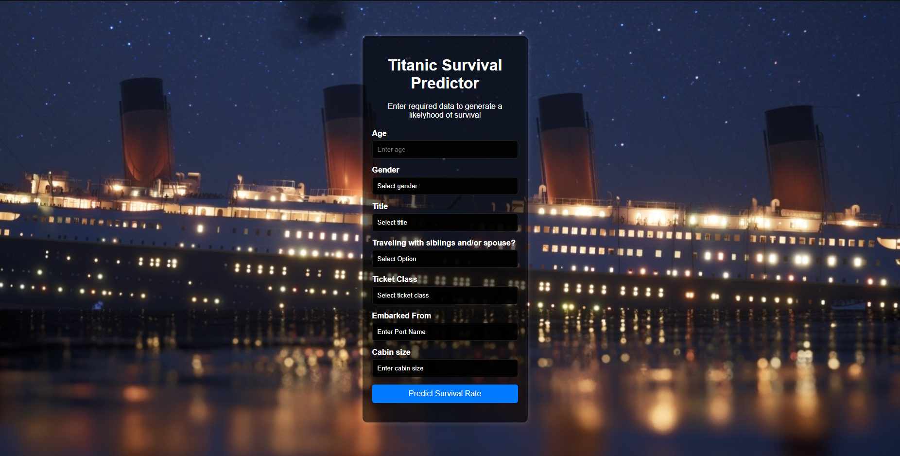

# Titanic Survival Predictor App

### Data Introduction:

**The dataset** 

The goal is to predict the `Survival` variable (Classification).

There are 11 independent variables (including `PassengerId`):

* `PassengerId` : Unique identifier of each passenger
* `pclass` : Ticket class refering to 1 - 1st, 2 - 2nd, 3 - 3rd
* `sex` : Passenger gender
* `Age` : Passenger age
* `sibsp` : Signifies the number of the passenger's siblings / spouses aboard the Titanic
* `parch` : Signifies the number of the passenger's parents / children aboard the Titanic
* `ticket` : Passenger's ticket number
* `fare` : Ticket cost
* `cabin` : Cabin number
* `embarked` : Port name from which the passenger embarked from

Target variable:
* `Survived`: Boolean value => 0/1 - No/Yes

Kaggle Dataset Link:
[https://www.kaggle.com/competitions/titanic/data](https://www.kaggle.com/competitions/titanic/data)

# Render Deployment

Render link: [https://titanic-ml-kaggle.onrender.com](https://titanic-ml-kaggle.onrender.com)

<!-- # UI

 -->

# Project Approach

1. Data Ingestion: 
    * The Data Ingestion script reads the data in the format provided in Kaggle which is separate CSV files for the training and test sets. 
    * Since the provided test data file does not contain any labels, the training data get split and saved into separate train and test data CSVs.

2. Data Transformation: 
    * In this phase a ColumnTransformer Pipeline is created to handle all of the data transfromation.
    * SimpleImputer is used for Numeric features with a strategy of `median`. Then the data is scaled using StandardScaler. The only exception is `Fare`which gets replaced by `norm_fare` a normalized (log(Fare + 1)) version of the feature.
    * SimpleImputer is used for Categorical Features as well but with a strategy of `most frequent`. OneHotEncoder and StandardScaler are applied next.
    * This preprocessor is saved to a pickle file for later use.
    * Feature engineering - a few features were created in order to either simplify an existing feature or try and derive more detailed information from it:
        - `cabin_multiple`: Derived from the `cabin` feature with the aim of figuring out if the number of passengers per cabin has any relevance
        - `name_title`: Pulled from passenger names and serves a very similar purpose to gender
    

3. Model Training: 
    * This script trains and evaluates a list of provoded models.
    * Hyperparameters for the most promissing models are tuned as well.
    * A VotingCalssifier is used at the end since that seemed to provide the best results. It utilises the best performing tuned models.
    * The best performing model is saved for later use.

4. Prediction Pipeline: 
    * This pipeline utilizes the saved model and preprocessor object, loading each from the respective pickle file in order to predict a given datapoint and return the prediction along with the model's level of certainty.

5. Flask App:
    * A simple Flask app houses the user interface where input is received for the prediction pipeline and also displays the resulting output.

# Jupyter Notebook

All research and model training was done using Jupyter Notebook.

Link to Notebook file: [./notebook/Titanic-Machine-Learning-from-Disaster.ipynb](./notebook/Titanic-Machine-Learning-from-Disaster.ipynb)